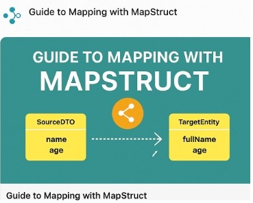

- Mapping Mastery with MapStruct: The Definitive Guide to Seamless Java Bean Transformation
  — Unlock the full potential of MapStruct for efficient, high‑performance data mapping.
- The Ultimate Comprehensive Guide to MapStruct’s @Mapper Annotation: Unleash Superior Mapping Solutions
  — Dive deep into the cutting‑edge features and best practices that make the @Mapper annotation a game‑changer in Java.
- MapStruct Properties Unleashed: Best Practices for Peak Performance and Next‑Generation Mapping Efficiency
  — Discover innovative property strategies to optimize your mapping configurations and achieve unparalleled performance.
  Each headline is crafted to capture attention, boost searchability, and clearly communicate the advanced mapping solutions offered by MapStruct.

### [Guide to Mapping with MapStruct](GuideToMappingWithMapStruct.md)
### [A Comprehensive Guide to MapStruct's @Mapper Annotation Properties](ComprehensiveGuide@MapperAnnotationProperties.md)
### [Best Pratices and Performance](BestPraticesAndPerformenceComparision.md)